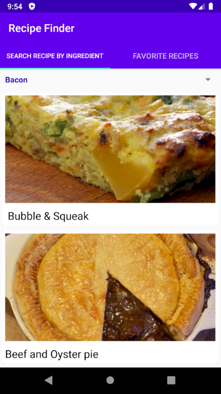
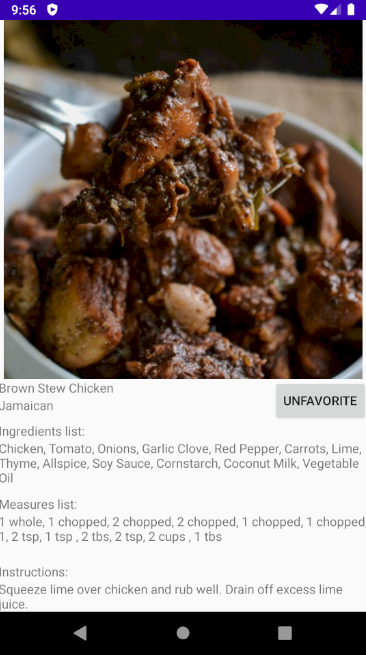

## Recipe Finder

This is a simple Android app that uses [TheMealDB's api](https://www.themealdb.com/api.php) to fetch recipes. The user can then save them as favourite and the recipes will then be stored on the device, enabling the user to browse their favourite recipes without internet connection.

